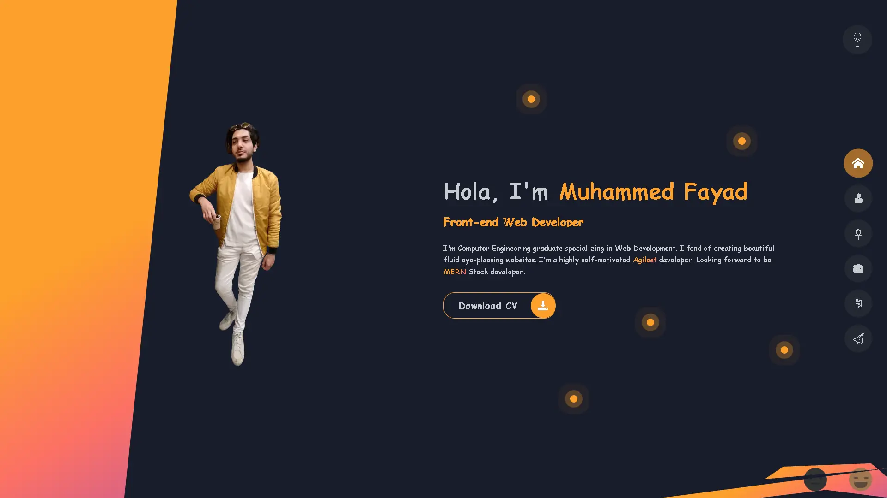
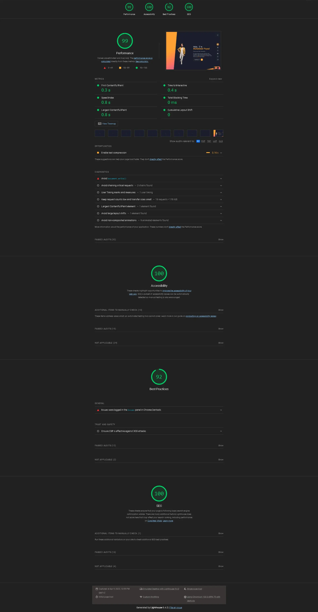

# <a>Portfolio </a>

## My Personal Portfolio

### Table of Contents

- [Overview](#Overview)
- [Features](#Features)
- [Todo-List](#TODO)
- [Timeline](#Timeline)
- [Stats report](#Report)
- [Contact](#Contact)

### Overview

My personal portfolio. I've tried to gather all my tricks & work-arounds I learnt so far in it, so it will serve as a showcase to my skills in the present!

#### Features

<menu>
	<li>Advanced project structure SASS/Pug/Gulp</li>
	<li>Components oriented project</li>
	<li>Used Gulp to compress images to minify MBs for the max limit!</li>
	<li>Dynamically created controllers based on the main sections --performance & blogging purposes</li>
	<li>hide controllers on idle state</li>
	<li>localStorage to save settings</li>
	<li>loading state</li>
	<li>Downloaded icons separately to minify KBs... considering SVGs</li>
	<li>Limiting scroll, mousemove events on their perspective sections --performance purposes</li>
	<li>Coordinated Complex Animation timeline stamps</li>
	<li>Timely preview dialogs</li>
	<li>Validation Form</li>
	<li>Improved preformance by 36%, accessability 23%, best practices by 12%, SEO by 24%</li>
</menu>

 
 

#### TODO:

- [x] dw hover interchange clrs
- [x] dark toggle functionlity
- [x] smiley faces home bg
- [ ] 9 dots Menu on mobile
- [ ] Hexagon hover
- [x] one-section on bigger devices
- [x] falling animation on active section!
- [x] loading state with animated word
- [ ] Spinners at certificates section
- [x] eye follow at contact section --Contact me word
- [x] custom scrollbar
- [x] localStorage to save settings 'such as dark/light mode'
- [x] animate skills' bars
- [x] fading effect on shadow text
- [x] FIXDONE: timeline stamps on mobile view --> timeliner on left, stamps on right 1-col
- [x] hover img greyscale -> ..
- [x] effect trail follow mouse
- [ ] fixed sidebar on the left .... fakely created by dom fragment
- [x] form input bottom borders
- [x] timely disappear controllers on idle state
- [x] click on img popup a viewer screen with x btn
- [x] complete meta file
- [x] FIXDONE Autoplacement IE supports
- [x] Edge supports
- [x] FIXDONE sections' padding in Edge browser
- [x] FIXDONE clean any hover effect on large screens only
- [x] FIXDONE disable idle state on home section
- [x] FIXDONE iusse font family, timeline on mobile view
- [x] mousemove event only at contact section
- [x] reset css
- [x] clean build/js files
- [x] Fully functional submitting form
- [x] add links in the grid popup preview
- [x] dynamically creating controllers into fragment based on sections number
- [x] validation system of the form
- [x] run tests for performance, accessability, SEO, best practices

### Timeline

<pre>
1st Day: 26/3/2022
first Dev session:      01:12 PM    ~   07:32 PM        ~ 06h 20m

2nd Day: 27/3/2022
first Dev session:      11:12 AM    ~   05:23 PM        ~ 06h 11m
second Dev session:     08:28 PM    ~   11:35 PM        ~ 03h 07m

3th Day: 28/3/2022
first Dev session:      12:05 PM    ~   04:15 PM        ~ 05h 38m
second Dev session:     05:43 PM    ~   06:21 PM        ~ 00h 38m

4th Day: 29/3/2022
first Dev session:      01:10 PM    ~   06:52 PM        ~ 05h 42m

5th Day: 30/3/2022
first Dev session:      12:10 AM    ~   05:02 AM        ~ 04h 52m
second Dev session:     03:11 PM    ~   06:45 PM        ~ 03h 34m
third Dev session:      06:37 PM    ~   12:15 AM        ~ 05h 38m
</pre>

<pre><q>Initial Development Completed in   <code>41h 40m</code></q></pre>

 
 
 

#### Report

    
Website Stats Report

    

 
 
 

#### Contact

🤩 Leave a :star:&nbsp;if you like it, Please!

 

📫 Please hit me up at mohammed.yuossry@gmail.com if you have any feedback or improvements.
